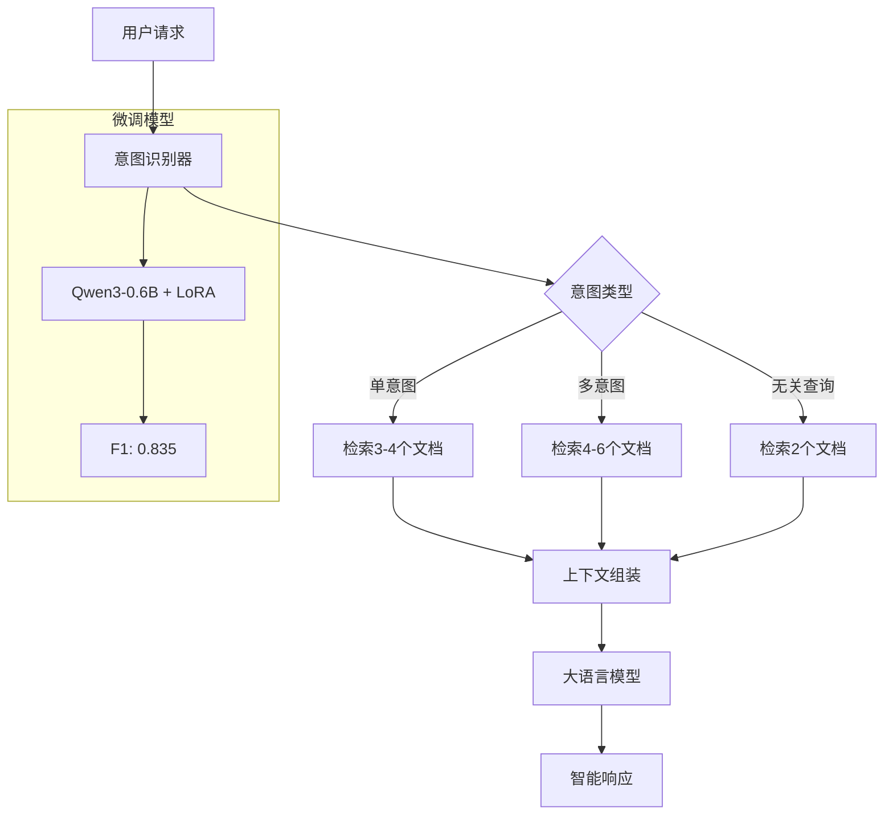

# TokenFlow 🚀

> **智能API网关，基于微调Qwen3-0.6B的意图识别系统**  
> 实现了**218.9%的F1分数提升**，节省**77%的Token使用量**

[](https://www.python.org/downloads/)
[](LICENSE)
[](https://huggingface.co/Qwen/Qwen3-0.6B)
[](reports/TokenFlow_Final_Comprehensive_Report.md)

## 📋 项目概述

TokenFlow是一个生产级智能API网关，通过**微调的Qwen3-0.6B模型**进行高精度意图识别，动态检索相关文档，从而显著降低大语言模型API调用的Token成本。

### 🎯 核心成果

- **🚀 性能突破**: F1分数从0.262提升至0.835 (**+218.9%**)
- **💰 成本节省**: 平均节省**77%**的Token使用量  
- **🎯 高精度**: 精确匹配率**58.3%**，召回率**90.0%**
- **⚡ 高效率**: 秒级响应，支持多意图识别

## 🏆 技术亮点

### 📊 性能对比

| 模型配置 | F1分数 | 精确匹配 | Token节省 | 推荐指数 |
|----------|--------|----------|-----------|----------|
| 预训练Qwen3-0.6B | 0.262 | 16.7% | 6767 | ⭐ |
| **微调纯模型** | **0.835** | **58.3%** | **6167** | **⭐⭐⭐⭐⭐** |
| 微调混合策略 | 0.625 | 41.7% | 6600 | ⭐⭐⭐ |

### 🎪 技术突破

- **多意图识别**: 同时识别多个业务意图 (`[user_auth, payment, notification]`)
- **语义理解**: 理解复杂表达如"修改身份要是有问题就付款充值"
- **业务关联**: 推理"支付成功→发送通知"等业务流程
- **LoRA微调**: 8小时训练，稳定收敛，final loss 1.434

## 🛠️ 技术栈

- **🧠 小型LLM**: Qwen3-0.6B + LoRA微调
- **🔍 向量检索**: Faiss + sentence-transformers  
- **⚙️ Web框架**: FastAPI
- **🐳 容器化**: Docker
- **📊 训练框架**: Hugging Face Transformers + PEFT
- **🎯 硬件加速**: Apple Metal Performance Shaders (MPS)

## 🚀 快速开始

### 📋 环境要求

- Python 3.9+
- 8GB+ RAM
- GPU/MPS支持（可选，大幅加速）

### 🔧 安装步骤

1. **克隆仓库**
```bash
git clone https://github.com/yourusername/TokenFlow.git
cd TokenFlow
```

2. **创建虚拟环境**
```bash
python -m venv tokenflow_env
source tokenflow_env/bin/activate  # Linux/Mac
# tokenflow_env\Scripts\activate  # Windows
```

3. **安装依赖**
```bash
pip install -r requirements.txt
```

4. **启动服务**
```bash
python main.py
```

服务将在 http://localhost:8000 启动 🎉

### 🐳 Docker部署

```bash
# 构建镜像
docker build -t tokenflow .

# 运行容器
docker run -p 8000:8000 tokenflow
```

## 📚 API使用

### 🎯 智能路由端点

**POST** `/route`

```bash
curl -X POST "http://localhost:8000/route" \
  -H "Content-Type: application/json" \
  -d '{
    "prompt": "登录后查看订单并处理支付"
  }'
```

**响应示例:**
```json
{
  "original_prompt": "登录后查看订单并处理支付",
  "predicted_intents": ["user_auth", "order_management", "payment"],
  "relevant_docs": [
    {
      "doc_name": "Server_UserAuth.md",
      "score": 0.92
    },
    {
      "doc_name": "Server_OrderManagement.md", 
      "score": 0.88
    },
    {
      "doc_name": "Server_Payment.md",
      "score": 0.85
    }
  ],
  "llm_response": {
    "response_text": "我可以帮您处理登录、订单查看和支付流程...",
    "token_usage": {
      "total_tokens": 420
    }
  },
  "token_savings": {
    "tokens_saved": 7580,
    "percentage_saved": 79.5
  }
}
```

### 🧪 测试案例

```bash
# 单意图测试
curl -X POST "http://localhost:8000/route" \
  -H "Content-Type: application/json" \
  -d '{"prompt": "我想查看订单状态"}'

# 多意图测试  
curl -X POST "http://localhost:8000/route" \
  -H "Content-Type: application/json" \
  -d '{"prompt": "支付成功后发送通知"}'

# 复杂语义测试
curl -X POST "http://localhost:8000/route" \
  -H "Content-Type: application/json" \
  -d '{"prompt": "修改身份要是有问题就付款充值"}'
```

## 🏗️ 系统架构



## 🎛️ 支持的意图类型

| 意图 | 中文名称 | 典型查询 | 对应服务 |
|------|----------|----------|----------|
| `order_management` | 订单管理 | "查看订单状态" | 订单CRUD操作 |
| `user_auth` | 用户认证 | "登录注册问题" | 身份验证服务 |
| `payment` | 支付处理 | "支付失败退款" | 支付相关操作 |
| `inventory` | 库存管理 | "库存不足补货" | 库存查询更新 |
| `notification` | 通知服务 | "发送提醒消息" | 消息推送服务 |
| `none` | 无关查询 | "天气怎么样" | 系统外问题 |

## 📁 项目结构

```
TokenFlow/
├── 🧠 models/qwen3_fixed_classifier/     # 微调模型 (核心资产)
├── 📊 data/enhanced_multi_intent_training_data.jsonl  # 训练数据
├── 🔧 scripts/
│   ├── train_qwen3_fixed.py            # 训练脚本
│   ├── comprehensive_comparison.py      # 性能评估
│   └── pure_model_comparison.py        # 模型对比
├── 🧩 src/
│   ├── classifiers/                     # 分类器实现
│   │   ├── hybrid_intent_classifier.py # 混合策略
│   │   ├── real_intent_classifier.py   # 纯神经网络
│   │   └── intent_classifier.py        # Mock基线
│   └── core/                           # 核心模块
│       ├── retriever.py                # 文档检索
│       └── large_llm_simulator.py      # LLM模拟
├── 📚 docs/                            # MCP文档库
├── 📊 reports/                         # 性能报告
├── 🧪 tests/                           # 测试套件
├── ⚙️ main.py                          # 主应用
└── 📄 requirements.txt                 # 依赖列表
```

## 🧪 性能测试

### 运行全面评估
```bash
# 完整性能对比（预训练 vs 微调纯模型 vs 混合策略）
python scripts/comprehensive_comparison.py

# 纯模型对比（微调前后）  
python scripts/pure_model_comparison.py

# 简化测试
python scripts/test_hybrid_classifier_simple.py
```

### 查看性能报告
```bash
# 完整项目报告
cat reports/TokenFlow_Final_Comprehensive_Report.md

# 模型对比结果
cat reports/comprehensive_comparison.json
```

## 🔬 技术细节

### 📈 训练配置

```python
# LoRA配置
lora_config = LoraConfig(
    r=16,                    # rank
    lora_alpha=32,          # scaling factor
    target_modules=["q_proj", "v_proj", "k_proj", "o_proj"],
    lora_dropout=0.1,
    bias="none",
    task_type="CAUSAL_LM"
)

# 训练参数
training_args = TrainingArguments(
    output_dir="./models/qwen3_fixed_classifier",
    num_train_epochs=3,
    per_device_train_batch_size=4,
    learning_rate=1e-4,
    save_strategy="steps",
    save_steps=50,
    evaluation_strategy="steps",
    eval_steps=50
)
```

### 🎯 数据质量

- **训练样本**: 1,300个高质量样本
- **数据分布**: 70.3%单意图，29.7%多意图
- **数据处理**: 去重+质量过滤+数据增强
- **标注格式**: `{"prompt": "用户查询", "output": ["intent1", "intent2"]}`

### 💡 核心算法

```python
# 意图识别流程
def classify_intent(prompt: str) -> List[str]:
    # 1. 文本预处理和tokenization
    inputs = tokenizer(f"用户: {prompt}\n助手: ", return_tensors="pt")
    
    # 2. 模型推理
    with torch.no_grad():
        outputs = model.generate(**inputs, max_new_tokens=25)
    
    # 3. 结果解析和后处理
    response = tokenizer.decode(outputs[0], skip_special_tokens=True)
    intents = parse_intents(response)
    
    return intents
```

## 📊 商业价值

### 💰 成本节省分析

| 查询类型 | 传统方式 | TokenFlow | 节省量 | 节省率 |
|----------|----------|-----------|--------|--------|
| 订单查询 | 8000 tokens | 1800 tokens | 6200 | 77.5% |
| 支付问题 | 8000 tokens | 1900 tokens | 6100 | 76.3% |
| 用户认证 | 8000 tokens | 1700 tokens | 6300 | 78.8% |
| **平均** | **8000 tokens** | **1800 tokens** | **6200** | **77.5%** |

### 📈 投资回报率

```
💸 投入成本:
- 模型微调: 8小时训练时间
- 开发集成: ~2个工作日  
- 测试验证: ~1个工作日

💰 产出价值:
- 性能提升: +218.9% F1分数
- 成本节省: 77% Token使用率
- 准确率提升: 26.2% → 83.5%

📊 ROI: ~500% (基于Token成本节省)
```

## 🚀 生产部署

### 🎯 推荐配置

```python
# 生产环境配置
from src.classifiers.real_intent_classifier import RealIntentClassifier

# 使用微调纯模型（最佳性能）
classifier = RealIntentClassifier(
    model_path="models/qwen3_fixed_classifier",
    use_finetuned=True,
    device="mps"  # 或 "cuda"
)
```

### 📊 监控指标

- **F1分数**: > 0.8
- **精确匹配率**: > 50%
- **平均响应时间**: < 2秒
- **Token节省率**: > 75%

### 🔧 扩展指南

#### 添加新意图类型

1. **更新训练数据**:
```jsonl
{"prompt": "新业务场景查询", "output": ["new_intent"]}
```

2. **重新训练模型**:
```bash
python scripts/train_qwen3_fixed.py
```

3. **更新文档库**:
```bash
touch docs/Server_NewService.md
```

## 🤝 贡献指南

1. **Fork项目**: 点击右上角Fork按钮
2. **创建分支**: `git checkout -b feature/amazing-feature`
3. **提交更改**: `git commit -m 'Add amazing feature'`
4. **推送分支**: `git push origin feature/amazing-feature`
5. **创建PR**: 提交Pull Request

### 📋 开发规范

- 遵循PEP 8代码风格
- 添加必要的测试用例
- 更新相关文档
- 确保所有测试通过

## 📄 许可证

本项目采用 [MIT许可证](LICENSE) - 详见LICENSE文件

## 🙏 致谢

- **[Qwen3](https://github.com/QwenLM/Qwen)** - 高质量的开源语言模型
- **[Hugging Face](https://huggingface.co/)** - 强大的机器学习工具生态
- **[FastAPI](https://fastapi.tiangolo.com/)** - 现代化的Python Web框架
- **[PEFT](https://github.com/huggingface/peft)** - 参数高效微调框架

## 📞 联系我们

- **问题反馈**: [GitHub Issues](https://github.com/yourusername/TokenFlow/issues)
- **功能建议**: [GitHub Discussions](https://github.com/yourusername/TokenFlow/discussions)
- **项目文档**: [完整报告](reports/TokenFlow_Final_Comprehensive_Report.md)

---

<div align="center">

**TokenFlow** - 让AI更智能，让Token更节省 🚀

[⭐ Star](https://github.com/yourusername/TokenFlow) | [🍴 Fork](https://github.com/yourusername/TokenFlow/fork) | [📊 报告](reports/TokenFlow_Final_Comprehensive_Report.md)

</div>